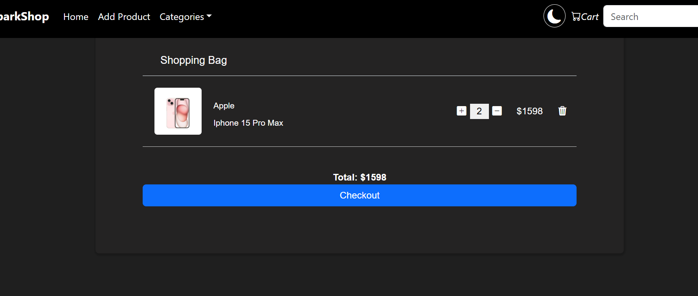

# E-Commerce-Springboot

# 🛍️ E-Commerce Product Management System

A **high-performance Product Management System** built with **Spring Boot 3.3.3** and **MySQL**, designed to serve as a robust backend for e-commerce platforms.  
It provides **secure REST APIs** for managing products, handling digital assets, and performing cart operations.  
This system can be easily integrated with any frontend such as **React.js**.

---

## 🎯 Project Objective
To develop and implement a **Product Management System** that efficiently manages **product information**, **images**, and **shopping cart operations** through standardized and secure REST APIs.

---

## 🔧 Features
### 👤 Product Module
- Add new products with details and images.
- Update/Edit product information.
- Delete products from the catalog.
- Retrieve product details (single or list).
- Search products using keywords.

### 🛒 Cart Module
- Add products to the cart.
- View all products in the cart.
- Remove products from the cart.
- Checkout to simulate order placement.

### ⚡ Other Functionalities
- Full product lifecycle management.
- Image upload & retrieval.
- Cross-origin frontend integration.

---

## 🧱 System Architecture
The system follows a **multi-layered monolithic architecture**:
1. **Presentation Layer** – REST controllers handling HTTP requests/responses.
2. **Service Layer** – Business logic for product and cart operations.
3. **Data Access Layer** – Spring Data JPA repositories for database interaction.
4. **Entity Layer** – Java classes representing database tables.

---

## 🔗 API Endpoints

### Product Management
| Method | Endpoint                        | Description                |
|--------|----------------------------------|----------------------------|
| GET    | `/api/products`                 | Retrieve all products      |
| GET    | `/api/product/{id}`             | Get product by ID          |
| GET    | `/api/product/search?keyword=xyz`| Search products by keyword |
| POST   | `/api/product`                  | Add a new product          |
| PUT    | `/api/product/{id}`             | Update existing product    |
| DELETE | `/api/product/{id}`             | Delete a product           |

### Cart Management
| Method | Endpoint                | Description               |
|--------|-------------------------|---------------------------|
| GET    | `/api/cart`             | View cart items           |
| POST   | `/api/cart/add/{productId}` | Add product to cart     |
| DELETE | `/api/cart/remove/{productId}` | Remove product from cart |
| POST   | `/api/cart/checkout`    | Checkout/Place order      |

---

## 📂 Project Structure
```
com.spark.springecom
├── controller                # REST Controllers (e.g., ProductController, CartController)
├── service                   # Service Layer Interfaces and Implementations
├── repository                # Spring Data JPA Repositories
├── model                     # Entity Classes (e.g., Product, Cart)
└── SpringEcomApplication     # Main Application Class
```

## 🖼Screenshots

| Feature | Preview |
|--------|---------|
| **Frontend Homepage** |  |
| **Product Profile** |  |
| **MySQL Database** |  |
| **Add Product** |  |
| **Search Product** |  |
| **Cart Checkout** |  |

## Demo Video
Watch a short demo of the project in action:  
[](videos/demo.mp4)  
